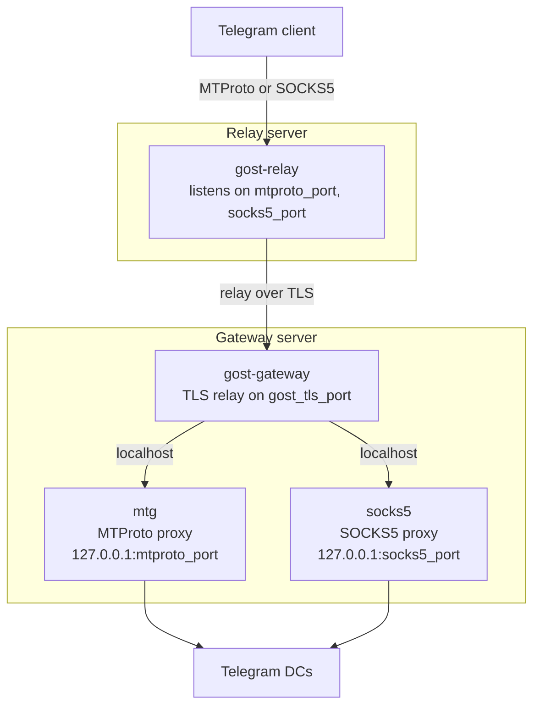
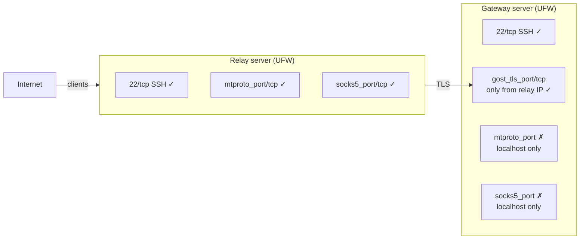

> # ✊ Breakout
>
> Easy way to up your virtual private network.

## 💡 Idea

Nothing special, just to find a way to set up and run a personal VPN quickly.

## 🏆 Motivation

Internet censorship has been increasing steadily for the last decade. Needs more?
[10 reasons why you need a VPN](https://www.techradar.com/news/10-reasons-why-you-need-a-vpn).

## 🏗️ Architecture

### Outline VPN (single-server)

A single server running [Outline VPN](https://www.getoutline.org/) (Shadowbox) inside Docker
with automatic updates via Watchtower.

```bash
$ make setup
```

### Telegram proxy (two-node chain)

A two-node relay scheme for Telegram designed to bypass deep packet inspection (DPI).
Direct connections to proxy servers outside the allowed zone are blocked by ISPs,
so traffic is routed through an intermediate relay server inside the allowed zone.


#### How it works



**Relay server** accepts client connections and wraps them in a TLS tunnel using
[GOST v3](https://github.com/go-gost/gost). For DPI, this traffic looks like regular HTTPS.

**Gateway server** runs two proxy services, both bound to `127.0.0.1` only (not exposed externally):

| Service | Image | Purpose |
|---------|-------|---------|
| [mtg](https://github.com/9seconds/mtg) | `nineseconds/mtg:2` | MTProto proxy for Telegram |
| [socks5](https://github.com/serjs/socks5-server) | `serjs/go-socks5-proxy` | SOCKS5 proxy with authentication |

GOST's relay protocol multiplexes both MTProto and SOCKS5 streams
through a **single TLS connection** on one port.

#### Firewall rules



#### Deployment

```bash
$ make telegram
```

#### Telegram client configuration

**MTProto** (native, no password required):
- Server: `<relay_ip>`
- Port: `<mtproto_port>`
- Secret: printed during deployment, also stored at `/opt/mtg/secret` on gateway

Or use a link: `tg://proxy?server=<relay_ip>&port=<mtproto_port>&secret=<secret>`

**SOCKS5** (universal):
- Server: `<relay_ip>`
- Port: `<socks5_port>`
- Username / Password: as configured in inventory

## How to

### Outline VPN

```bash
$ export VPN_NAME=gateway   # your server name, any way you like
$ export VPN_HOST=127.0.0.1 # your server ip

$ cat ansible/hosts.tpl.ini \
  | sed "s/{{.Name}}/${VPN_NAME}/g" \
  | sed "s/{{.Host}}/${VPN_HOST}/g" \
  > ansible/hosts

$ make
```

### Telegram proxy

Fill in all template placeholders in `ansible/hosts.tpl.ini` and generate the inventory:

```bash
$ cat ansible/hosts.tpl.ini \
  | sed "s/{{.Name}}/${VPN_NAME}/g" \
  | sed "s/{{.Host}}/${VPN_HOST}/g" \
  | sed "s/{{.RelayName}}/${RELAY_NAME}/g" \
  | sed "s/{{.RelayHost}}/${RELAY_HOST}/g" \
  | sed "s/{{.GatewayName}}/${GATEWAY_NAME}/g" \
  | sed "s/{{.GatewayHost}}/${GATEWAY_HOST}/g" \
  | sed "s/{{.MTProtoPort}}/${MTPROTO_PORT}/g" \
  | sed "s/{{.SOCKS5Port}}/${SOCKS5_PORT}/g" \
  | sed "s/{{.GostTLSPort}}/${GOST_TLS_PORT}/g" \
  | sed "s/{{.MTGDomain}}/${MTG_DOMAIN}/g" \
  | sed "s/{{.SOCKS5User}}/${SOCKS5_USER}/g" \
  | sed "s/{{.SOCKS5Password}}/${SOCKS5_PASSWORD}/g" \
  > ansible/hosts

$ make telegram
```

### Recommended providers

| Provider           | Availability | IPv6 | Price      |
|:-------------------|:-------------|:----:|-----------:|
| [DigitalOcean][do] | worldwide    |  ✓   | $5/month   |
| [Linode][linode]   | worldwide    |  ✓   | $5/month   |
| [Vultr][vultr]     | worldwide    |  ✓   | $2.5/month |

<small>☝️ all links are referral</small>

## 🧩 Installation

```bash
$ git clone git@github.com:octomation/breakout.git && cd breakout
```

## 👨‍🔬 Research

### Articles

At DigitalOcean

- [ ] [How To Set Up and Configure a Certificate Authority (CA) On Ubuntu 20.04](https://www.digitalocean.com/community/tutorials/how-to-set-up-and-configure-a-certificate-authority-ca-on-ubuntu-20-04).
- [ ] [How To Set Up and Configure an OpenVPN Server on Ubuntu 20.04](https://www.digitalocean.com/community/tutorials/how-to-set-up-and-configure-an-openvpn-server-on-ubuntu-20-04).

At Serverwise

- [ ] [How To Install OpenVPN On Ubuntu 18.04](https://blog.ssdnodes.com/blog/install-openvpn-ubuntu-18-04-tutorial/)
- [x] [Outline VPN: How to install it on your server](https://blog.ssdnodes.com/blog/outline-vpn-tutorial-vps/).
- [ ] [Streisand VPN: How To Install And Configure](https://blog.ssdnodes.com/blog/streisand-vpn-tutorial/).

### Sources

- [ ] [Jigsaw-Code/outline-server](https://github.com/Jigsaw-Code/outline-server)
  - [x] [install_server.sh](research/Jigsaw-Code/outline-server/src/server_manager/install_scripts/install_server.sh)
- [ ] [angristan/openvpn-install](https://github.com/angristan/openvpn-install)
- [ ] [angristan/wireguard-install](https://github.com/angristan/wireguard-install)
- [ ] [kylemanna/docker-openvpn](https://github.com/kylemanna/docker-openvpn)
- [ ] [Nyr/openvpn-install](https://github.com/Nyr/openvpn-install)
- [ ] [Nyr/wireguard-install](https://github.com/Nyr/wireguard-install)
- [ ] [StreisandEffect/streisand](https://github.com/StreisandEffect/streisand)
- [ ] [timurb/ansible-digitalocean-vpn](https://github.com/timurb/ansible-digitalocean-vpn)

### Toolset

- [Ansible is Simple IT Automation](https://www.ansible.com/).
  - [Ansible at GitHub](https://github.com/ansible).
- [Empowering App Development for Developers | Docker](https://www.docker.com/).
  - [Docker at GitHub](https://github.com/docker).
- [Outline VPN - Access to the free and open internet](https://www.getoutline.org/).
  - [Outline at GitHub](https://github.com/Jigsaw-Code/?q=outline).
- [GOST v3 - GO Simple Tunnel](https://github.com/go-gost/gost).
- [mtg - MTProto proxy for Telegram](https://github.com/9seconds/mtg).
- [serjs/socks5-server - SOCKS5 proxy](https://github.com/serjs/socks5-server).
- Docker images
  - [containrrr/watchtower at Docker Hub](https://hub.docker.com/r/containrrr/watchtower).
  - [outline/shadowbox at Quay.io](https://quay.io/repository/outline/shadowbox).
  - [gogost/gost at Docker Hub](https://hub.docker.com/r/gogost/gost).
  - [nineseconds/mtg at Docker Hub](https://hub.docker.com/r/nineseconds/mtg).
  - [serjs/go-socks5-proxy at Docker Hub](https://hub.docker.com/r/serjs/go-socks5-proxy).

#### Upcoming

- [VPN Software Solutions & Services For Business | OpenVPN](https://openvpn.net/).
  - [OpenVPN at GitHub](https://github.com/OpenVPN).
  - [Tunnelblick | Free open source OpenVPN VPN client server software for macOS](https://www.tunnelblick.net/).
- [WireGuard: fast, modern, secure VPN tunnel](https://www.wireguard.com/).
  - [WireGuard at GitHub](https://github.com/wireguard).
- [Best VPN Service for Secure Networks - Tailscale](https://tailscale.com/).
  - [Tailscale at GitHub](https://github.com/tailscale).
- [SoftEther VPN Project](https://www.softether.org/).
  - [SoftEther VPN at GitHub](https://github.com/SoftEtherVPN).
- [Vagrant by HashiCorp](https://www.vagrantup.com/).
  - [Vagrant at GitHub](https://github.com/hashicorp?q=vagrant).

<p align="right">made with ❤️ for everyone</p>

[do]:     http://bit.ly/vps-do-ref
[linode]: http://bit.ly/vps-linode-ref
[vultr]:  http://bit.ly/vps-vultr-ref
