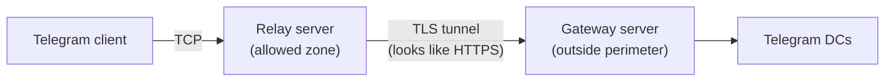
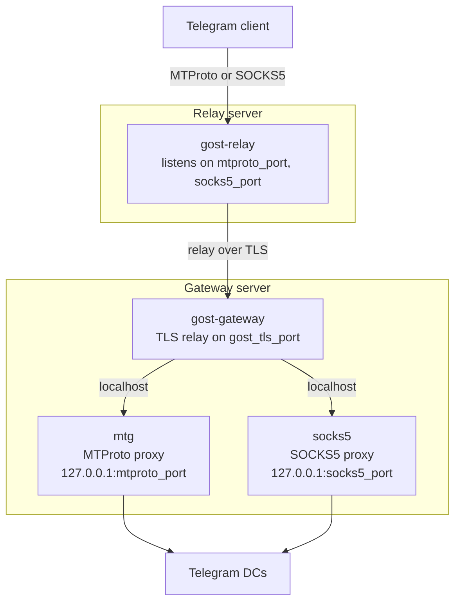
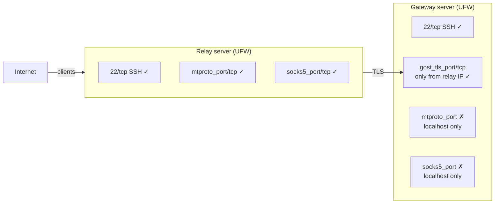

> # ✊ Breakout
>
> Easy way to escape environment limitations.

## 💡 Idea

Nothing special, just to find a way to set up VPN and proxy with ease.

## 🏆 Motivation

Internet censorship has been increasing steadily for the last decade. Needs more?
[10 reasons why you need a VPN](https://www.techradar.com/news/10-reasons-why-you-need-a-vpn).

## 🏗️ Architecture

### Outline VPN (single-server)

A single server running [Outline VPN](https://www.getoutline.org/) (Shadowbox) inside Docker
with automatic updates via Watchtower.

```bash
$ make setup
```

### Telegram proxy (two-node chain)

A two-node relay scheme for Telegram designed to bypass deep packet inspection (DPI).
Direct connections to proxy servers outside the allowed zone are blocked by ISPs,
so traffic is routed through an intermediate relay server inside the allowed zone.



#### How it works



**Relay server** accepts client connections and wraps them in a TLS tunnel using
[GOST v3](https://github.com/go-gost/gost). For DPI, this traffic looks like regular HTTPS.

**Gateway server** runs two proxy services, both bound to `127.0.0.1` only (not exposed externally):

| Service | Image | Purpose |
|---------|-------|---------|
| [mtg](https://github.com/9seconds/mtg) | `nineseconds/mtg:2` | MTProto proxy for Telegram |
| [socks5](https://github.com/serjs/socks5-server) | `serjs/go-socks5-proxy` | SOCKS5 proxy with authentication |

GOST's relay protocol multiplexes both MTProto and SOCKS5 streams
through a **single TLS connection** on one port.

#### Firewall rules



#### Deployment

```bash
$ make telegram
```

#### Telegram client configuration

**MTProto** (native, no password required):
- Server: `<relay_ip>`
- Port: `<mtproto_port>`
- Secret: printed during deployment, also stored at `/opt/mtg/secret` on gateway

Or use a link: `tg://proxy?server=<relay_ip>&port=<mtproto_port>&secret=<secret>`

**SOCKS5** (universal):
- Server: `<relay_ip>`
- Port: `<socks5_port>`
- Username / Password: as configured in inventory

### Monitoring (all servers)

[Vector](https://vector.dev/) agent deployed as a Docker container on every server.
Collects Docker container logs and host metrics (CPU, memory, disk, network),
ships them to [Grafana Cloud](https://grafana.com/products/cloud/) (Loki for logs, Prometheus for metrics).

```bash
$ make monitoring
```

Requires Grafana Cloud credentials configured in the inventory
(see `{{.VectorLoki*}}` and `{{.VectorPrometheus*}}` placeholders in `ansible/hosts.tpl.ini`).

## How to

### Outline VPN

```bash
$ export VPN_NAME=gateway   # your server name, any way you like
$ export VPN_HOST=127.0.0.1 # your server ip

$ cat ansible/hosts.tpl.ini \
  | sed "s/{{.VpnName}}/${VPN_NAME}/g" \
  | sed "s/{{.VpnHost}}/${VPN_HOST}/g" \
  > ansible/hosts

$ make
```

### Telegram proxy

Fill in all template placeholders in `ansible/hosts.tpl.ini` and generate the inventory:

```bash
$ cat ansible/hosts.tpl.ini \
  | sed "s/{{.VpnName}}/${VPN_NAME}/g" \
  | sed "s/{{.VpnHost}}/${VPN_HOST}/g" \
  | sed "s/{{.RelayName}}/${RELAY_NAME}/g" \
  | sed "s/{{.RelayHost}}/${RELAY_HOST}/g" \
  | sed "s/{{.GatewayName}}/${GATEWAY_NAME}/g" \
  | sed "s/{{.GatewayHost}}/${GATEWAY_HOST}/g" \
  | sed "s/{{.MTProtoPort}}/${MTPROTO_PORT}/g" \
  | sed "s/{{.SOCKS5Port}}/${SOCKS5_PORT}/g" \
  | sed "s/{{.GostTLSPort}}/${GOST_TLS_PORT}/g" \
  | sed "s/{{.MTGDomain}}/${MTG_DOMAIN}/g" \
  | sed "s/{{.SOCKS5User}}/${SOCKS5_USER}/g" \
  | sed "s/{{.SOCKS5Password}}/${SOCKS5_PASSWORD}/g" \
  | sed "s/{{.VectorLokiEndpoint}}/${VECTOR_LOKI_ENDPOINT}/g" \
  | sed "s/{{.VectorLokiUser}}/${VECTOR_LOKI_USER}/g" \
  | sed "s/{{.VectorLokiApiKey}}/${VECTOR_LOKI_API_KEY}/g" \
  | sed "s/{{.VectorPrometheusEndpoint}}/${VECTOR_PROMETHEUS_ENDPOINT}/g" \
  | sed "s/{{.VectorPrometheusUser}}/${VECTOR_PROMETHEUS_USER}/g" \
  | sed "s/{{.VectorPrometheusApiKey}}/${VECTOR_PROMETHEUS_API_KEY}/g" \
  > ansible/hosts

$ make telegram
```

### Recommended providers

| Provider           | Availability | IPv6 | Price      |
|:-------------------|:-------------|:----:|-----------:|
| [DigitalOcean][do] | worldwide    |  ✓   | $5/month   |
| [Linode][linode]   | worldwide    |  ✓   | $5/month   |
| [Vultr][vultr]     | worldwide    |  ✓   | $2.5/month |

<small>☝️ all links are referral</small>

## 🧩 Installation

```bash
$ git clone git@github.com:octomation/breakout.git && cd breakout
```

<p align="right">made with ❤️ for everyone</p>

[do]:     http://bit.ly/vps-do-ref
[linode]: http://bit.ly/vps-linode-ref
[vultr]:  http://bit.ly/vps-vultr-ref
